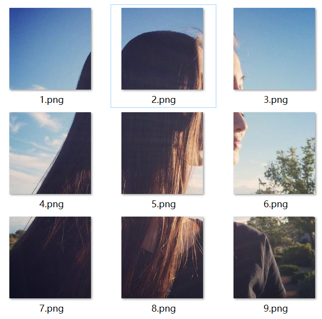

# 一开始的图片：

# 运行后的图片：

# 参考：

https://zhuanlan.zhihu.com/p/34658133

https://blog.csdn.net/qq_29027865/article/details/81561584

https://blog.csdn.net/xc_zhou/article/details/87866317

https://github.com/unlimitbladeworks/python-tools/blob/master/automation/cut-picture/cut.py
